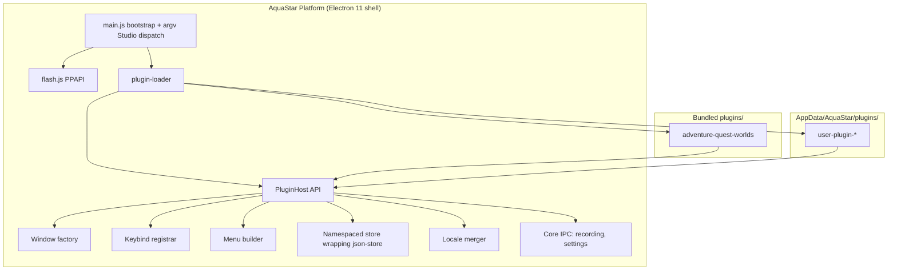
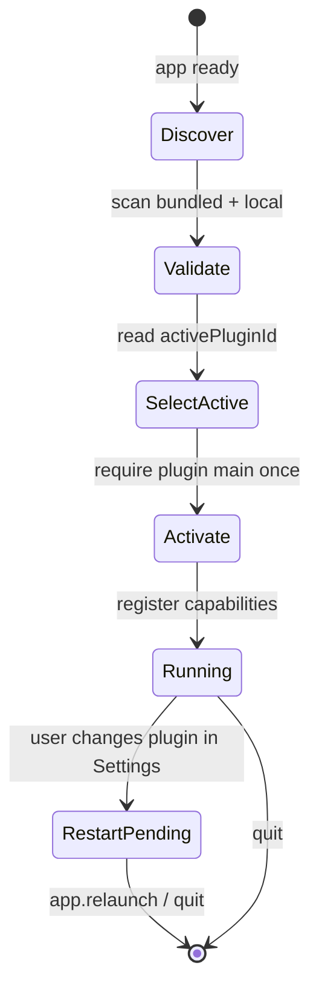
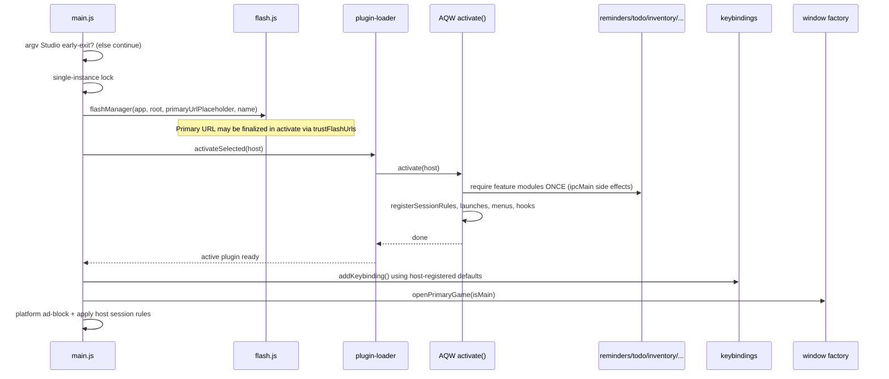

# AquaStar Plugin Architecture

| Field | Value |
|-------|--------|
| **Author** | TBD |
| **Date** | 2026-09-16 |
| **Status** | Approved for implementation (pending repo copy) |
| **Related** | `AGENTS.md`, `res/const.js`, `main.js`, `web/`, Electron 11.5.0 + PPAPI Flash constraints |
| **package.json version** | `1.12.2` (use this, not older AGENTS narrative versions, for `minAppVersion`) |

---

## Overview

AquaStar is today a Flash-capable Electron 11 launcher whose product surface is ~80% hardcoded for AdventureQuest Worlds (AQW): URLs, menus, keybinds, page injections (WikiView, account sync), Char Page Studio (including a **second Electron process**), Reminders/To-Do/Strategy seasonal calendars, Inventory sync against `account.aq.com`, locales, and the static web tools site. The goal of this design is to turn that specialization into an explicit **plugin** so AquaStar becomes a reusable Flash-game companion shell, while preserving **no user-visible AQW regression on default settings** for existing users.

The proposed approach is a **strangler-fig migration**: first extract stable platform interfaces and an AQW adapter that owns the existing side-effect `require` graph (so IPC registers **exactly once**), then relocate AQW code under `plugins/adventure-quest-worlds/`, then enable a single-active-plugin selector (restart-to-apply) with optional local plugins under AppData. DragonFable remains a secondary URL/shortcut inside the AQW plugin. The `web/` static tools site is pluginized under the same contract.

> **Compatibility promise (narrowed):** We guarantee no user-visible AQW regression for the default bundled plugin and existing `aquastar.json` / `aquastar_*.json` data. We do **not** claim bit-for-bit identity of every internal module path, settings object shape in memory, or hot-switch lifecycle. Intentional differences are listed under [Compatibility: intentional differences](#compatibility-intentional-differences).

---

## Background & Motivation

### Current state

AquaStar’s runtime is organized roughly as:

| Layer | Location | Role today |
|-------|----------|------------|
| Argv early exits | `main.js` top | `--charpage-studio` / `--charpage-studio-capture` spawn dedicated processes before normal boot |
| Entry / session filters | `main.js` `createWindow` | Single-instance lock, Flash trust bootstrap, ad block, `*.aq.com` / DragonFable UA spoof, SWF logging, media permission gate |
| Flash / Chromium flags | `res/flash.js` | PPAPI path, performance switches, `nw-flash-trust` for **primary** SWF path only |
| Constants + defaults | `res/const.js` | AQW/DF URLs, keybind/option defaults, Ruffle/SWF wrappers, settings paths |
| Window factory | `res/instances.js` | Game vs browser windows, wrapping, WikiView + sync-button injection, Char Page print, Studio `spawn` |
| Keybinds + settings IPC | `res/keybindings.js` | Shortcuts; loads/saves `aquastar.json`; game-menu dispatcher |
| Window configs | `res/windows/config.js` | BrowserWindow shapes; **game/wiki/charpage/studio: `plugins: true`; settings/reminders/todo/inventory/strategy: `plugins: false`** |
| Menus | `res/windows/menu.js` | App + game menus with AQW link catalog |
| Features | `res/features/**` | Reminders, To-Do, Strategy, Inventory, WikiView, Char Page Studio, Settings, Capture — many register `ipcMain` on `require` |
| Persistence helper | `res/repositories/json-store.js` | Shared `read` / `write` / `readOrCreate` used by feature modules |
| Shared domain | `res/core/*`, `res/features/common/*`, `res/ui/workspace/*` | Reset-time, list-state, list UI, character tabs / modals (also copied into web-dist) |
| Locales | `res/po/en-US.js`, `res/po/pt-BR.js` | Heavily AQW-named strings |
| Web tools | `web/`, `scripts/build-web.js` | Copies kits + feature HTML, injects bridges, emits locale JSON |

### Pain points

1. **Hardcoded game identity** — Changing URLs/menus requires editing many modules.
2. **No extension point** — Other Flash titles need a fork today.
3. **Mixed concerns** — Platform (screenshots, recording, settings shell) intertwined with AQW domain.
4. **Web parity is AQW-only** — No plugin-aware packaging path; build hardcodes feature paths.

### Product decisions (accepted)

1. **Distribution**: Bundled plugins + local AppData folder.
2. **Activation**: Exactly **one active plugin**; menus/keybinds/windows follow it.
3. **DragonFable & web**: DF inside AQW plugin; `web/` under same contract.

---

## Goals & Non-Goals

### Goals

1. Complete inventory of AQW-specific vs game-agnostic vs core-platform code.
2. Define a **Plugin API** that can reproduce today’s AQW UX when AQW is active (legacy IPC channel names, legacy JSON paths).
3. Extract interfaces first; migrate without user-visible regression on default settings.
4. Mount **"Adventure Quest Worlds"** as the first bundled plugin; document authoring.
5. Bundled + local loading on Electron 11 via CommonJS `require` only.
6. Per-plugin storage namespaces with **permanent AQW filename aliases**.
7. Pluginize the web tools build (full `contributeWebBuild` schema matching `scripts/build-web.js`).
8. Incremental PR plan; `npm test` green; Flash checklist on high-risk PRs.

### Non-Goals

- Electron > 11.5.0 or dropping PPAPI Flash.
- Multi-plugin simultaneous activation.
- Marketplace / remote install / auto-update of plugins.
- Chromium-extension-grade sandbox for local plugins (in-process CJS = full trust after prompt).
- Splitting DragonFable into its own plugin.
- Rewriting feature UIs from scratch.

---

## Inventory: AQW vs Agnostic vs Platform

Classification keys:

- **Platform (P)** — Shell-owned; plugins use via Host.
- **Agnostic kit (K)** — Shared libraries; plugins configure.
- **AQW plugin (A)** — Moves into `plugins/adventure-quest-worlds/`.
- **Hybrid (H)** — Platform mechanism with plugin-supplied data.

### Table 1 — Core shell & bootstrap

| Component | Path(s) | Class | Notes |
|-----------|---------|-------|-------|
| App entry, single-instance | `main.js` | P/H | Session filters become plugin-registered; entry stays platform |
| Char Page Studio argv dispatch | `main.js` early return → `scripts/charpage-studio-*.js` | A (+P shim) | Second process; must stay plugin-aware after moves |
| Flash manager | `res/flash.js` | P | Today trusts **one** path (`constant.mainPath`); Host wraps `trustManager.add` |
| Media / display-capture permission | `main.js` `setPermissionRequestHandler` | H | Allows only when window’s `aquaStarSwfUrl` is Ruffle-eligible game URL |
| App paths, icons, version | `res/const.js` (partial) | P | Keep platform paths; move game URLs |
| AQW/DF URL catalog | `res/const.js` | A | Plugin `urls` + `games` |
| Keybind/option defaults | `res/const.js` | H | Platform schema; AQW supplies defaults |
| Custom SWF (`aqlite_old.swf`) | `const.js`, Settings IPC | **P** | Platform **primary-game override** for whatever plugin is active (see Key Decisions) |
| SWF / Ruffle wrappers | `swf_wrapper.html`, `ruffle_wrapper.html`, helpers | H | Wrappers platform; eligibility/opts plugin |
| Socket proxy / Ruffle update | `socketProxy.js`, `ruffleUpdate.js`, `res/ruffle/` | P | Always available; **started/used only when active plugin opts into Ruffle** |
| JSON store helper | `res/repositories/json-store.js` | P/K | Namespaced store **wraps** this; do not fork a second persistence stack |

### Table 2 — Windows, menus, keybinds

| Component | Path(s) | Class | Notes |
|-----------|---------|-------|-------|
| Window configs | `res/windows/config.js` | H | Game/main/wiki-style: `plugins: true`, sandbox false for game; feature tools: `plugins: false`, sandbox true. **Correction vs AGENTS.md:** Flash plugin is **not** enabled on settings/reminders/todo/inventory/strategy |
| Feature window controller | `res/windows/feature-window-controller.js` | P | Generic singleton |
| Menus | `res/windows/menu.js` | H | Items + open-mode from plugin |
| Window factory + injections | `res/instances.js` | H | Hooks for classify/inject; Studio spawn |
| Keybinds | `res/keybindings.js` | H | Registrar + platform settings IPC |
| Screenshots / recording | `takeSS`, `res/ipc/recording.js`, `capture/` | P | `isGameUrl()` from plugin |
| Settings UI | `res/features/settings/` | P/H | Platform shell; plugin option sections |

### Table 3 — Feature modules

| Feature | Path(s) | Class | Notes |
|---------|---------|-------|-------|
| Reminders / To-Do / Strategy | `res/features/{reminders,todo,strategy}/**` | A (+K) | Defaults + seasonal copy are A |
| List window common | `res/features/common/list_window_common.js` | K | |
| Workspace UI | `res/ui/workspace/{character-tabs,modals}.js` | K | Used by desktop features **and** `scripts/build-web.js`; was missing from rev 1 inventory |
| List state / reset time | `res/core/list-state.js`, `reset-time.js` | K→H | Parameterized factories; AQW defaults |
| Inventory / WikiView / Charpage | `res/features/{inventory,wikiview,charpage}/**` | A | Includes Studio SWFs + lab |
| Studio process scripts | `scripts/charpage-studio-process.js`, `charpage-studio-capture-process.js` | A | Hardcoded `res/features/charpage` paths today |
| Account sync button | `accountSyncButton.js` | A | |

### Table 4 — Locales, packaging, web, tests

| Component | Path(s) | Class | Notes |
|-----------|---------|-------|-------|
| Locale loader | `res/locale.js` | P | Merge platform + plugin namespaces |
| Locale strings | `res/po/*` | H/A | Split chrome vs AQW |
| Web landing | `web/assets/landing.js` | A | |
| Web bridges | `web/bridges/*` | H/A | Bridge files stay under `web/bridges` or move with plugin contribution |
| Web build script | `scripts/build-web.js` | P | Consumes `contributeWebBuild()` |
| Ad-block | `main.js` | P | Global |
| electron-builder `files: **/*` | `package.json` | P | Already includes `plugins/`; add CI assert |

### Approximate coupling

| Bucket | Share | Examples |
|--------|-------|----------|
| AQW plugin | ~70–80% | URLs, WikiView, Inventory, Studio+spawn, calendars, most locales |
| Kits | ~10–15% | list-state/reset-time, list_window_common, workspace UI, json-store, feature-window-controller |
| Platform | ~10–15% | Flash, recording, settings shell, window factory, plugin loader |

---

## Proposed Design

### High-level architecture



### One-active-plugin model (restart-to-apply)

**v1 decision:** Changing `activePluginId` writes settings and **prompts for app restart**. There is no in-process Deactivate→Activate hot-switch in v1 (Electron 11 `webRequest` listener removal is unreliable; duplicate `ipcMain.handle` is fatal).



Rules:

- Exactly one plugin’s `activate(host)` runs **per process lifetime**.
- `deactivate` is reserved for process shutdown cleanup only in v1 (optional); plugin switch = restart.
- Settings always available; Plugin section lists discovered plugins + trust UI for local.

### Directory layout (target)

```text
AquaStar/
  main.js
  scripts/
    charpage-studio-process.js          # thin shim → plugin entry (until deleted)
    charpage-studio-capture-process.js  # thin shim → plugin entry
  res/
    platform/
      flash.js
      plugin-host.js
      plugin-loader.js
      manifest-schema.js
      window-factory.js
      keybind-registrar.js
      menu-builder.js
      locale.js
      storage/namespaced-store.js       # wraps repositories/json-store.js
      ipc/recording.js
    repositories/json-store.js          # unchanged primitive
    kits/
      list-state.js
      reset-time.js
      list-window-common.js
      feature-window-controller.js
    ui/workspace/
      character-tabs.js
      modals.js
    features/
      settings/                         # platform
      capture/                          # platform
  plugins/
    adventure-quest-worlds/
      plugin.json
      main.js
      urls.js
      menus.js
      keybinds.js
      session.js
      injections/
      features/                         # reminders, todo, strategy, inventory, charpage, wikiview
      processes/                        # studio process entrypoints after move
      locales/
      web/
      defaults/
    _template/                          # lands early (PR 1) for contract tests
  test/fixtures/sample-plugin/          # minimal fixture used by loader tests
```

### Plugin loading on Electron 11

Constraints: CommonJS only; `asar: false`; no native ESM in main; no bundler required for plugins.

Loader algorithm:

1. Discover `plugin.json` under bundled `plugins/*` and (if `enableLocalPlugins`) AppData `plugins/*`.
2. Validate schema. **Id collision:** if local id equals a bundled id and `allowLocalPluginOverride !== true`, **fail that local entry** with a Settings-visible error (`Local plugin id "…" conflicts with bundled plugin; enable allowLocalPluginOverride or rename`). Bundled remains loadable.
3. Resolve `activePluginId` (default `adventure-quest-worlds`).
4. For local plugins: require `trustedLocalPlugins[id]` covering requested permissions; else refuse activate and fall back.
5. `require(main)` → `{ activate, deactivate? }`.
6. `await activate(host)` **before** creating the primary game window and **before** any second registration of feature IPC.
7. On failure: dialog + fall back to bundled AQW.

### Boot sequence (PR 2 — critical to avoid double IPC)

Today `main.js` eagerly requires feature/IPC modules so `ipcMain.handle` runs as import side effects. The adapter must **own** that graph exclusively.



| Mode | Feature `require`s live in | `main.js` feature requires |
|------|----------------------------|------------------------------|
| `pluginSystem: true` (default from PR 2) | AQW `activate()` | **Removed** |
| `AQUASTAR_DISABLE_PLUGINS=1` or `pluginSystem: false` | `main.js` as today | **Kept** (legacy graph) |

**Invariant:** each legacy IPC channel registers exactly once. PR 2 adds a unit/integration assert over the channel inventory table.

Platform-owned modules that stay in `main.js` even with plugins: `res/ipc/recording.js` (or Host registers once), settings IPC inside keybindings — **not** re-required by the plugin.

### Char Page Studio — separate process (AQW capability)

Studio is not only an in-process feature window:

1. `instances.openCharPageStudioWindow()` spawns `process.execPath` with `--charpage-studio` (detached).
2. `main.js` early-returns into `scripts/charpage-studio-process.js` (and capture variant) **before** normal plugin UI boot.
3. Those scripts load assets under `res/features/charpage/` today.

**Design:**

- Studio remains an **AQW-owned** capability. Manifest permission: `spawn-helper-process`.
- Platform API: `host.windows.spawnHelperProcess({ argvFlag, scriptRelativePath })` where `scriptRelativePath` must resolve **inside the plugin root** after normalization (no `..` escape). Implementation: `spawn(process.execPath, defaultAppArgs.concat([argvFlag]), { detached, stdio: 'ignore' })`.
- `main.js` argv dispatch becomes plugin-aware:

```js
// Pseudocode
if (argvHas('--charpage-studio')) {
  const entry = resolveBundledPluginScript('adventure-quest-worlds',
    'processes/charpage-studio-process.js'); // or legacy scripts/ shim
  require(entry);
  return;
}
```

- During PR 8a, keep thin shims at `scripts/charpage-studio-*.js` that `require` the plugin paths so existing spawn argv keeps working.
- **Local plugins:** `spawn-helper-process` allowed only for paths under that plugin’s directory; Studio-equivalent is not granted to untrusted plugins without trust entry. Capture subprocess same rules.
- Packaging: plugin `processes/` and SWF assets must be in the electron-builder output (covered by `**/*`; CI packs and asserts files exist).

### PluginHost API (normative)

The Host is a facade. **Security note:** with in-process `require(pluginMain)`, a local plugin *can* `require('electron')` directly. The Host API is the **supported contract** for bundled/reference plugins and what trust UI describes; it is **not** a hard security boundary. After the user trusts a local plugin, treat it as full Node/Electron trust (same as installing software).

Migration-only escape: AQW plugin may `require()` legacy modules until PR 8 completes; marked `// @migration-legacy` and removed when shims die.

```js
/**
 * @typedef {Object} JsonStore
 * @property {() => any} read
 * @property {(value: any) => any} write
 * @property {(createValue: () => any) => any} readOrCreate
 * // Implemented by wrapping res/repositories/json-store.js against resolveStorePath().
 */

/**
 * @typedef {Object} GameLaunchConfig
 * @property {string} id
 * @property {() => string} getUrl
 * @property {(ctx: { displayName: string, settings: object }) => string} [title]
 * @property {(url: string) => boolean} isGameUrl
 * @property {{ preferDirectWmode?: boolean, ruffleEligible?: boolean, wmode?: string, scale?: string }} [wrap]
 * @property {boolean} [flashTrust]  // if true, host.trustFlashUrls includes getUrl() result
 */

/**
 * @typedef {Object} LaunchEntry
 * @property {string} id
 * @property {string} [keybindId]
 * @property {() => string} getUrl
 * @property {(ctx: object) => string} [title]
 * @property {GameLaunchConfig['wrap']} [wrap]
 * @property {boolean} [flashTrust]
 * @property {'game'|'browser'} [windowKind]  // default game if isGameUrl
 */

/**
 * @typedef {Object} SessionRule
 * @property {string} id
 * @property {string[]} urls  // Electron filter URLs
 * @property {(settings: object) => boolean} [enabledWhen]
 * @property {(details: Electron.OnBeforeSendHeadersListenerDetails, ctx: { spoofedUA: string }, callback: Function) => void} [onBeforeSendHeaders]
 * @property {(details: Electron.OnBeforeRequestListenerDetails, ctx: { logLine: function }, callback: Function) => void} [onBeforeRequest]
 * // IMPORTANT: adapters MUST call Electron callbacks in today's shapes:
 * //   callback({ requestHeaders: details.requestHeaders })
 * //   callback({ cancel: false }) / callback({ cancel: true })
 * // Session rules are register-once-per-process; v1 plugin switch = restart.
 */

/**
 * @typedef {Object} NavigationHooks
 * @property {(url: string) => string} [classify]  // 'wiki'|'charpage'|'account'|'game'|'other'|...
 * @property {(ctx: { win: Electron.BrowserWindow, url: string, executeJavaScriptSafely: Function }) => void|Promise<void>} [onDidFinishLoad]
 * @property {(url: string) => boolean} [allowChildWindow]
 */

/**
 * @typedef {Object} FeatureWindowDef
 * @property {string} id
 * @property {Electron.BrowserWindowConstructorOptions} config
 * @property {string} url  // file:// or https
 * @property {string} title
 * @property {(win: Electron.BrowserWindow) => void} [configure]
 */

/**
 * @typedef {Object} KeybindRegistration
 * @property {string} id
 * @property {string|string[]} [defaultAccelerator]
 * @property {(focusedWin: Electron.BrowserWindow|null) => void} action
 * @property {boolean} [onlyHtml]
 * @property {boolean} [considerDF]
 * @property {boolean} [global]  // use globalShortcut (F2 / recording style)
 */

/**
 * @typedef {(ctx: {
 *   keybinds: object,
 *   actions: Record<string, Function>,
 *   openLink: (url: string, mode: 'new-window'|'in-place') => void
 * }) => Electron.MenuItemConstructorOptions[]} MenuContributor
 */

/**
 * @typedef {Object} PluginHost
 * @property {string} appVersion
 * @property {string} appRootPath
 * @property {string} appDataDirectory
 * @property {string} pluginId
 * @property {string} pluginRoot
 * @property {string} pluginDataDirectory
 * @property {(ns: string) => JsonStore} getStore
 * @property {(defs: Record<string, string|string[]|boolean|number|string> ) => void} registerKeybindDefaults
 * @property {(bindings: KeybindRegistration[]) => void} registerKeybinds
 * @property {(contributor: MenuContributor) => void} registerMenus
 * @property {(windows: FeatureWindowDef[]) => void} registerFeatureWindows
 * @property {(rules: SessionRule[]) => void} registerSessionRules  // requires permission web-request
 * @property {(hooks: NavigationHooks) => void} registerNavigationHooks  // requires inject-scripts when hooks inject
 * @property {(entries: LaunchEntry[]) => void} registerLaunches
 * @property {(cfg: GameLaunchConfig) => void} setPrimaryGame
 * @property {(urls: string[]) => void} trustFlashUrls
 * @property {(catalog: Record<string, object>) => void} registerLocales
 * @property {() => object} getPlatformSettings
 * @property {(section: object) => void} registerSettingsSection
 * @property {HostIpc} ipc
 * @property {HostNet} net
 * @property {HostWindows} windows
 * @property {(msg: string) => void} log
 */

/**
 * @typedef {Object} HostIpc
 * @property {(channel: string, listener: Function) => void} handle
 * @property {(channel: string, listener: Function) => void} on
 * @property {(channel: string) => void} removeHandler
 * // Channel naming policy — see IPC compatibility section.
 * // All handlers registered through host.ipc are tracked and removed on process exit.
 */

/**
 * @typedef {Object} HostNet
 * @property {(url: string, opts?: { maxBytes?: number, timeoutMs?: number }) => Promise<{ ok: boolean, html?: string, error?: string }>} fetchText
 * // Enforces manifest.fetchAllowlist when present; requires permission net-fetch.
 */

/**
 * @typedef {Object} HostWindows
 * @property {(opts?: { isMain?: boolean }) => Electron.BrowserWindow} openPrimaryGame
 * @property {(launchId: string) => Electron.BrowserWindow} openLaunch
 * @property {(featureId: string) => Electron.BrowserWindow} openFeatureWindow
 * @property {(url: string, mode?: 'new-window'|'in-place') => void} openUrl
 * @property {(opts: { argvFlag: string, scriptRelativePath: string }) => ChildProcess} spawnHelperProcess
 */
```

**Permission enforcement (v1 — real checks, not advisory):** before performing the privileged operation, Host throws if the active manifest lacks the permission:

| Method | Required permission |
|--------|---------------------|
| `registerSessionRules` | `web-request` |
| `registerNavigationHooks` with injection | `inject-scripts` |
| `net.fetchText` | `net-fetch` |
| `trustFlashUrls` | `flash-trust` |
| `windows.spawnHelperProcess` | `spawn-helper-process` |
| `getStore` / persistent writes | `persistent-store` |
| Feature windows with `webSecurity: false` or `plugins: true` + custom protocol | `unsafe-renderer` |

Unknown permissions in the manifest → load failure. Missing permission on method call → throw; activation fails → fallback to bundled AQW.

### Lifecycle hooks

| Hook | When | Responsibilities |
|------|------|------------------|
| `activate(host)` | Once per process after loader selects plugin | Register capabilities; `require` feature IPC modules once |
| `deactivate(host)` | Process quit (optional in v1) | Remove host-tracked IPC; stop plugin timers |
| `onSettingsSaved(patch)` | After settings write | Optional |
| `contributeWebBuild()` | Node build script (no Electron) | Return full web contribution object |

### IPC compatibility (legacy vs namespaced)

**Conflict resolved:** auto-namespacing all channels would break AQW preloads.

| Plugin kind | Channel policy |
|-------------|----------------|
| Bundled `adventure-quest-worlds` (`apiVersion: 1`) | Register **exact legacy channel names** listed below |
| Third-party / local plugins | Host prefixes: `plugin:<id>:<channel>` unless `host.ipc.handle(channel, fn, { raw: true })` is explicitly allowed (discouraged; requires trust) |
| Platform | Unchanged: settings + recording channels |

#### Legacy channel inventory (must remain stable)

Split by process: the Studio helper process has its **own** `ipcMain` graph and must not be conflated with main-process “register exactly once” asserts.

##### Main process

| Channel | Module today | Owner after migration |
|---------|--------------|------------------------|
| `fetchWikiPage` | `res/ipc/wikiFetch.js` | AQW plugin (legacy name) |
| `saveDialog`, `saveRecording`, `getDesktopCapturerSourceForWindow` | `res/ipc/recording.js` | Platform |
| `getKeybindings`, `saveKeybindings`, `getRecordingFormat`, `getSettingsMessages`, `updateRuffle`, `getRuffleStatus`, `restoreBundledRuffle`, `restartApp`, `getCustomSwfStatus`, `chooseCustomSwf`, `removeCustomSwf` | `res/keybindings.js` | Platform |
| `getReminders`, `getRemindersMessages`, `saveReminders`, `remindersCopyText` | `reminders.js` | AQW |
| `getTodo`, `getTodoMessages`, `saveTodo`, `todoOpenLink`, `todoCopyText` | `todo.js` | AQW |
| `getStrategy`, `getStrategyMessages`, `saveStrategy`, `setStrategyTimerShortcut`, `clearStrategyTimerShortcut` | `strategy.js` | AQW |
| `getInventory`, `saveInventoryLabels`, `getInventoryMessages`, `getWikiMessages`, `syncInventoryNow`, `setInventoryActiveChar`, `matchWikiItem`, `matchWikiItems`, `getInventoryItemCounts`, `openInventoryItemWiki` | `inventory.js` | AQW |
| `charpage-studio-defaults`, `charpage-studio-load-character`, `charpage-studio-capture`, `charpage-studio-runtime-status`, `charpage-studio-open-devtools` | `res/features/charpage/studio.js` | AQW (in-process studio helpers / diagnostics path) |
| `charpage-studio-diagnostic` | `studio.js` → `webContents.send` | AQW (main→renderer event, not `handle`) |

PR 2 tests: snapshot the **main-process** set; assert single registration per channel in the normal app process.

##### Studio helper process (`--charpage-studio`)

Registered in `scripts/charpage-studio-process.js` (consumed by `res/features/charpage/lab/preload_lab.js`). Same string names may overlap main-process studio channels but run in a **separate Electron process**, so they do not collide with main `ipcMain`.

| Channel | Notes |
|---------|--------|
| `charpage-studio-defaults` | Process-local stub/defaults |
| `charpage-studio-messages` | **Process-only** (not in main `studio.js`) |
| `charpage-studio-load-character` | Process-local implementation |
| `charpage-studio-renderer-config` | **Process-only** |
| `charpage-studio-capture-preview` | **Process-only** |
| `charpage-studio-capture-gif` | **Process-only** |

PR 8a (and/or existing `test/unit/charpage-lab.test.js`): contract check that these process channels remain exported/registered after the move/shims. Do **not** fold them into PR 2’s main-process single-registration snapshot.

### Capability registration details

#### 1. Primary game & launches

```js
host.setPrimaryGame({
  id: 'aqw-main',
  getUrl: () => resolveAqwMainUrl(host), // Loader3, customUrl, or aqlite_old.swf file URL
  title: (ctx) => ctx.displayName + ' - ' + (isOldAqlite ? 'Older/Custom AQLite' : ' Adventure Quest Worlds'),
  isGameUrl: (url) => isMainOrTesting(url),
  wrap: { preferDirectWmode: true, ruffleEligible: true },
  flashTrust: true
});

host.registerLaunches([
  { id: 'aqw-testing', keybindId: 'newTest', getUrl: () => testingUrl, wrap: { preferDirectWmode: true, ruffleEligible: true }, flashTrust: true },
  { id: 'dragonfable', keybindId: 'dragon', getUrl: () => dfUrl,
    wrap: { wmode: 'opaque', scale: 'showall', ruffleEligible: true }, flashTrust: true }
]);
```

#### Flash trust semantics (`nw-flash-trust`)

Today `flash.js` calls `trustManager.empty()` then `trustManager.add(aqlitePath)` once for `constant.mainPath` (file URL or remote Loader3 string as passed today).

Host `trustFlashUrls(urls)`:

1. Resolves each URL the same way current code passes paths into `flashTrustManager` (including `file://` for `aqlite_old.swf`).
2. Clears and re-adds the trust list for the active plugin’s trusted game URLs (primary + launches with `flashTrust: true`).
3. Remote https SWFs and local file SWFs are both pass-through to `trustManager.add` as today — no new semantics.
4. Must run during activate **before** the first game window loads when possible; if flashManager already ran with a placeholder, Host exposes `host.refreshFlashTrust()` invoked at end of activate (PR 3 wires ordering).

#### 2. Session rules (Electron callback shapes)

```js
host.registerSessionRules([
  {
    id: 'artix-ua',
    urls: ['*://*.aq.com/*', '*://aq.com/*', '*://game.aq.com/*', '*://play.dragonfable.com/*'],
    onBeforeSendHeaders: (details, ctx, callback) => {
      details.requestHeaders['User-Agent'] = ctx.spoofedUA;
      details.requestHeaders['artixmode'] = 'launcher';
      callback({ requestHeaders: details.requestHeaders });
    }
  },
  {
    id: 'swf-log',
    urls: ['*://game.aq.com/game/*'],
    enabledWhen: (s) => s.swfLog === true,
    onBeforeRequest: (details, ctx, callback) => {
      ctx.logLine(details.url);
      callback({ cancel: false });
    }
  }
]);
```

Platform ad-block remains in `main.js` with the same `callback({ cancel: true })` pattern. Duplicate rule `id` → activation error.

#### 3. Navigation / injection

Unchanged intent; hooks receive `executeJavaScriptSafely`. Manifest must declare `injectHostPatterns` (e.g. `aqwwiki.wikidot.com`, `account.aq.com`); Host refuses injection when `ctx.url` host is outside the list.

#### 4. Feature windows

Same shape as `exports.featureWindows` in `res/windows/config.js` (`config`, `url`, `title`, optional `configure`).

#### 5. Menus & keybinds / open mode

Menu contributor receives `openLink(url, mode)`. **Preserve today’s per-surface behavior** (verified in `res/windows/menu.js`):

| Surface | Today’s implementation | Default `openMode` |
|---------|------------------------|--------------------|
| App / context menu Useful Pages (`generateLink`) | `focusedWin.webContents.loadURL(link)` | **`in-place`** |
| Same entries’ **keybinds** (`keybindings.js`) | `inst.newBrowserWindow(...)` | **`new-window`** |
| Game menu (`getGameMenu` → `runGameMenuAction`) | `newBrowserWindow` for wiki/account/charpage/etc. | **`new-window`** |

`generateLink` sets `registerAccelerator: false` specifically so the menu click stays in-place while the keybind still opens a new window — implementing Useful Pages as new-window from the app menu would be a **user-visible regression**.

Each menu item may set `openMode: 'new-window' | 'in-place'`. AQW plugin wiring must match the table above. PR 6 should add/extend a unit assertion that app-menu Useful Pages click handlers use in-place navigation (or equivalent Host `openUrl(..., 'in-place')`).

Platform-reserved keybind ids: `settings`, `fullscreen`, `sshot`, `record`, `reload`, `reloadCache`, `help`, `about`, `forward`, `backward`.

#### 6. Locales

`registerLocales({ 'en-US': {...}, 'pt-BR': {...} })`. Merger strategy:

- Platform owns: generic Settings chrome for recording/renderMode/devTools, about dialog shell, error dialogs.
- Plugin owns namespaced objects: `remindersMessages`, `todoMessages`, `strategyMessages`, `inventoryMessages`, plugin menu labels, seasonal events, helpDetail game lines.
- **No silent clobber:** plugin keys under reserved platform namespaces (`platformMessages`) are ignored with a log warning.

#### 7. Web bridge — `contributeWebBuild()` schema

Called from `scripts/build-web.js` via `require(pluginRoot/...)` in Node (no Electron). Return value:

```js
/**
 * @typedef {Object} WebBuildContribution
 * @property {{ landingHtml: string, landingJs: string, landingCss: string, iconFrom?: string }} landing
 * @property {Array<{
 *   id: string,
 *   sourceHtml: string,       // repo-relative path to desktop HTML
 *   bridge: string,           // repo-relative path to web/bridges/<id>.js or plugin bridge
 *   outToolsPath: string,     // e.g. tools/reminders/index.html
 *   defaultsJson?: string,    // optional seed JSON path
 *   localeKeys: string[]      // e.g. ['remindersMessages']
 * }>} tools
 * @property {string[]} sharedKits  // repo-relative paths copied to web-dist/core|ui|tools/common
 * @property {{ commonBridge: string }} bridges
 * @property {string} [localeModulePattern] // how to load en-US/pt-BR for JSON emit
 * @property {string} [kitDefaultsJson] // e.g. defaults/aqw-kit.json (seasonal keys + timezone)
 * @property {string} [kitBootstrap] // optional inline/bridge step: createListState(defaults) before list_window_common
 */
```

AQW contribution mirrors today’s `build-web.js`:

- `sharedKits`: `res/core/list-state.js`, `res/core/reset-time.js`, `res/ui/workspace/modals.js`, `res/ui/workspace/character-tabs.js`, `res/features/common/list_window_common.js` (or kits/ paths after moves)
- tools: reminders, todo, strategy with existing bridges
- After PR 8, `sourceHtml` points at `plugins/adventure-quest-worlds/features/...`
- Browser tools do **not** load Electron plugins; kits ship with AQW defaults JSON / factory defaults inlined for seasonal keys + timezone

**PR coupling:** any PR that moves feature HTML (PR 8a/8b) **must** update `contributeWebBuild` paths in the same PR and keep `npm run web:build` + `test/unit/web-build.test.js` green.

---

## Manifest schema

```json
{
  "id": "adventure-quest-worlds",
  "name": "Adventure Quest Worlds",
  "version": "1.0.0",
  "apiVersion": 1,
  "main": "main.js",
  "description": "Official AQW companion plugin for AquaStar",
  "author": "AquaStar",
  "minAppVersion": "1.12.2",
  "capabilities": [
    "game-launch", "session-rules", "navigation-hooks",
    "feature-windows", "menus", "keybinds", "locales", "web"
  ],
  "permissions": [
    "net-fetch", "web-request", "flash-trust", "inject-scripts",
    "persistent-store", "spawn-helper-process", "unsafe-renderer"
  ],
  "fetchAllowlist": [
    "https://aqwwiki.wikidot.com/*",
    "https://account.aq.com/*",
    "https://game.aq.com/*",
    "https://www.aq.com/*"
  ],
  "injectHostPatterns": [
    "aqwwiki.wikidot.com",
    "account.aq.com",
    "www.aq.com",
    "aq.com"
  ],
  "web": {
    "contribute": "web/contribute.js"
  }
}
```

Validation: id regex `^[a-z0-9]+(?:-[a-z0-9]+)*$`; `main` relative no `..`; unknown permissions fail load; `fetchAllowlist` / `injectHostPatterns` required when corresponding permissions present.

---

## Compatibility: AQW as first plugin

### Strangler-fig phases

**Phase A — Adapter owns side-effect requires** (PR 1–2)  
Loader + Host + AQW `activate()` requires today’s feature modules. `main.js` stops requiring them when `pluginSystem` true. Same IPC names, same JSON paths.

**Phase B — Session rules & URL catalog** (PR 3)  
UA/SWF log/URLs move into plugin; flash trust refresh ordering fixed.

**Phase C — Features relocate** (PR 8a shims, PR 8b delete shims)  
Physical move under `plugins/adventure-quest-worlds/`; Studio process shims; web paths updated in same PRs.

**Phase D — Selector + local plugins + docs** (PR 10–13)  
Restart-to-apply selector; local trust; template already present from PR 1.

### Compatibility checklist (user-visible)

1. Default load Loader3 unless `aqlite_old.swf` / `customUrl`.
2. Alt+N / Alt+Q / Alt+1 titles and wrapping.
3. UA spoof + `artixmode` on aq.com + DragonFable.
4. WikiView + account sync injection; `fetchWikiPage` CORS path.
5. Reminders/To-Do/Strategy/Inventory persistence + legacy IPC.
6. Char Page Alt+K; Char Page Studio **spawned process** still works.
7. `npm test`, `npm run web:build`, Flash manual checklist.

### Compatibility: intentional differences

| Area | Behavior |
|------|----------|
| Settings object | May gain `activePluginId`, `plugins{}`; top-level AQW keys still read |
| Keybind Settings UI | Lists platform-reserved + **active plugin** actions only |
| Plugin switch | Restart required (no hot-switch) |
| Internal paths | Files may move under `plugins/` after Phase C |
| AGENTS.md Flash-on-all-windows | Document corrected to match `config.js` |

### Settings schema

```json
{
  "activePluginId": "adventure-quest-worlds",
  "pluginSystem": true,
  "enableLocalPlugins": false,
  "allowLocalPluginOverride": false,
  "trustedLocalPlugins": {},
  "plugins": {
    "adventure-quest-worlds": {}
  }
}
```

**Option migration (owned by PR 7b / PR 10):** On load, platform reads legacy top-level `customUrl`, `playerCharacter`, `autoSync`, etc. Nested `plugins[id]` is optional overlay; **top-level remains authoritative for AQW through at least one minor release** so dual-write is unnecessary for v1. Nested copy may be written as a mirror for future multi-plugin options but must not change runtime resolution order (top-level wins for known legacy keys).

---

## API / Interface Changes

### Before

```js
const reminders = require('./res/features/reminders/reminders.js');
// ...
let win = inst.newBrowserWindow(constant.mainPath, true);
```

### After (pluginSystem true)

```js
const host = createPluginHost();
await activateSelectedPlugin(host); // AQW activate requires feature modules once
const finalkeyb = keyb.addKeybinding(host);
host.windows.openPrimaryGame({ isMain: true });
applyPlatformAdBlock();
applyHostSessionRules(host);
```

---

## Data Model Changes

### Storage

Namespaced store **wraps** `res/repositories/json-store.js`. AQW aliases forever:

| Namespace | Path |
|-----------|------|
| reminders/todo/strategy/inventory (AQW id) | `appDataDirectory/aquastar_<ns>.json` |
| any ns (other plugins) | `appDataDirectory/plugin-data/<id>/<ns>.json` |

### Parameterizing kits (factory API)

Do **not** replace the default UMD export with a bare factory function — that would break `test/unit/list-state.test.js` / `reset-time.test.js` (they call methods on `require(...)`) and `list_window_common.js` (`Object.assign` from `root.AquaStarListState` / `AquaStarResetTime` after a `<script>` tag).

**Required export shape (option a — preferred for PR 4):**

```js
// res/core/list-state.js
function createListState(options) {
  const SEASONAL_EVENT_KEYS = (options && options.seasonalEventKeys) || DEFAULT_AQW_SEASONAL_KEYS;
  // ... return API closing over keys
}
const defaultApi = createListState(); // AQW defaults — drop-in for today's export
// UMD: module.exports = defaultApi; root.AquaStarListState = defaultApi;
defaultApi.createListState = createListState;
defaultApi.DEFAULT_AQW_SEASONAL_KEYS = DEFAULT_AQW_SEASONAL_KEYS;
module.exports = defaultApi;
```

```js
function createResetTime(options) { /* timeZone, weeklyAnchorWeekday */ }
const defaultTime = createResetTime();
defaultTime.createResetTime = createResetTime;
module.exports = defaultTime; // + root.AquaStarResetTime = defaultTime in UMD branch
```

Custom calendars/timezones call `AquaStarListState.createListState(opts)` (or `require(...).createListState`) without mutating the shared default instance.

**Web / `contributeWebBuild` bootstrap:** when a tool needs non-default kit config, the contribution may include an optional `kitBootstrap` snippet or bridge step that loads `defaults/aqw-kit.json` and assigns `root.AquaStarListState = createListState(defaults)` **before** `list_window_common.js`. For AQW’s current defaults, the default UMD instance is enough (no extra bootstrap required). Document `kitBootstrap` as an optional field on `WebBuildContribution` / per-tool entry.

**Same PR (PR 4):** delete duplicated `SEASONAL_EVENT_KEYS` arrays in `reminders.js` / `todo.js`; update unit tests only if they should exercise `createListState` explicitly (default-export method tests keep working unchanged).

---

## Alternatives Considered

*(Unchanged in substance.)* Multi-plugin simultaneous — rejected. Fork-per-game — rejected. Utility-process sandbox — deferred. Config-only JSON packs — insufficient alone; optional later subset.

---

## Security & Privacy Considerations

### Honest model

In-process CJS plugins that pass trust prompts are **full trust** (Node + Electron). Host permission checks stop *honest* misuse and document intent; they do **not** stop a malicious plugin that ignores the Host and `require('electron')` directly.

### Manifest fields for policy

- `fetchAllowlist` — enforced by `host.net.fetchText`
- `injectHostPatterns` — enforced by navigation hook runner
- `spawn-helper-process` — script path must be under `pluginRoot` after `path.normalize` + `relative` check (`!rel.startsWith('..') && !path.isAbsolute(rel)`)

### Optional hardening (non-blocking)

- Optional `integrity.sha256` of `main.js` in manifest for local plugins; if present, loader verifies before require. Not required for bundled AQW (ships with app).

### Collisions

Local id == bundled id + override disallowed → skip local, surface error string in Settings plugin list; do not abort app boot.

### Privacy

Inventory sync still uses default session cookies for `account.aq.com`. No plugin telemetry in v1.

---

## Observability

| Signal | Mechanism |
|--------|-----------|
| Discover/load/activate | `console.log('[AquaStar:plugins] …')` |
| Duplicate session rule id | throw at register |
| Activation failure | dialog + fallback |
| Duplicate IPC | Electron throws; PR 2 test prevents |

**Log collection for Flash regressions:** the repo’s `logs/log.txt` is **not** an application-managed ring buffer today (aspirational / manual). Testers should capture: terminal/`npm start` stdout, Windows Event / console, and when enabled SWF log under `Pictures/AquaStar Screenshots/SWFLogging/`. Optional follow-up: pipe `console.log` to `appDataDirectory/aquastar-debug.log` — out of scope unless a later PR adds it.

### Flag defaults by milestone

| Flag | PR 1 | PR 2+ | PR 11+ |
|------|------|-------|--------|
| `pluginSystem` | `false` (code present, unused) or unused | `true` | `true` |
| `activePluginId` | n/a | `adventure-quest-worlds` | same |
| `enableLocalPlugins` | `false` | `false` | `false` until docs; then opt-in |
| `allowLocalPluginOverride` | `false` | `false` | `false` |

Env: `AQUASTAR_DISABLE_PLUGINS=1` forces legacy `main.js` require graph **until PR 8b removes shims**. **After PR 8b:** rollback = git revert / release rollback to last-known-good tag; env flag may be removed or only enable emergency bundled-AQW path without legacy file locations.

---

## Rollout Plan

1. **Before / with first implementation PR:** copy this design into the repo at `docs/design/plugin-architecture.md` (user-requested; do not leave the canonical copy only under temp paths).
2. PR 1–2: adapter on, default AQW, Flash checklist required on PR 2.
3. PR 3–7: extract without UX change.
4. PR 8a/8b: move files; web build gated in CI.
5. PR 10: selector restart-to-apply.
6. PR 11: local plugins behind flag.
7. Rollback: pre-8b use env flag; post-8b revert release tag.

---

## Open Questions

All items below are **resolved**. Items marked **user-confirmed** were explicitly confirmed by the product owner (not writer assumptions).

1. Hot-switch vs restart → **Resolved (design): restart for v1** (no in-process plugin hot-switch).
2. Keybind Settings UI shows only platform-reserved chrome + **active plugin** actions → **User-confirmed.**
3. Web-dist packages only the default plugin (AQW) at site root; other plugins as subpaths later → **User-confirmed.**
4. `unsafe-renderer` for Char Page Studio → **Resolved (design): yes for AQW**; blocked for untrusted local plugins without an explicit trust entry.
5. Generic quest-tracker kit reusable across games → **Deferred** (not in v1 scope).

---

## Documentation Outline (plugin authors)

As before, plus normative appendix below. Template/`test/fixtures/sample-plugin` lands in **PR 1**, not only PR 13.

---

## Risks

| Risk | Severity | Mitigation |
|------|----------|------------|
| Double `ipcMain.handle` in PR 2 | Critical | Boot table + channel assert tests |
| Studio process path break on move | Critical | Shims + Host spawn allowlist + CI file assert |
| Flash regression | High | Checklist on PR 2,3,5,6,8 |
| Local plugin malware | High | Default off + full-trust copy |
| Mega PR 8 | High | Split 8a/8b |
| web-build break on move | High | Same-PR path updates + CI |

---

## References

- `main.js`, `res/flash.js`, `res/const.js`, `res/instances.js`, `res/keybindings.js`
- `res/windows/config.js` (plugins true/false split), `menu.js`, `feature-window-controller.js`
- `res/repositories/json-store.js`, `res/ui/workspace/*`, `res/core/*`
- `res/features/**`, `res/ipc/*`, `scripts/charpage-studio-*.js`, `scripts/build-web.js`
- Product decisions; Electron 11.5.0; package version `1.12.2`
- **Repo copy (when implementation starts):** land the approved design at `docs/design/plugin-architecture.md` so the team has an in-tree canonical reference.

---

## Key Decisions

1. **One active plugin per process** — Predictable session/keybinds; product decision.
2. **Strangler-fig; adapter owns IPC side effects before moves** — Prevents duplicate handlers; no user-visible regression on defaults.
3. **CommonJS `require` only** — Electron 11.
4. **DragonFable is an AQW launch entry** — Not a separate plugin.
5. **Legacy AQW JSON filenames via aliases forever** — No forced data migration.
6. **Local plugins = full trust after prompt; Host is not a sandbox** — Honest Electron 11 + Flash model.
7. **Kits use factories + AQW defaults** — Safe for web and desktop.
8. **Web build consumes full `contributeWebBuild` schema; path updates ship with moves** — Matches real `build-web.js`.
9. **Plugin switch requires restart in v1** — Avoids `webRequest`/IPC teardown hazards; diagrams match.
10. **Platform-reserved vs plugin-owned keybind ids** — Universal chrome vs game actions.
11. **AQW keeps legacy IPC channel names; third-party uses `plugin:<id>:` prefix** — Exact preload compatibility.
12. **`customUrl` / `aqlite_old.swf` are platform primary-game overrides** — Apply to whichever plugin’s primary game is active; AQW copy/labels remain plugin locales.
13. **Ruffle, socketProxy, and Ruffle auto-update remain platform services**, started/used only when the active plugin marks launches `ruffleEligible` / user selects renderMode ruffle — not AQW-only code, not always-running proxy.
14. **Menu/link open mode is plugin-declared** (`new-window` vs `in-place`), with AQW defaults preserving today’s **per-surface** behavior: app-menu Useful Pages (`generateLink`) are **in-place** `loadURL`; game-menu and keybind actions that call `newBrowserWindow` are **new-window**.

---

## Appendix A — Minimal second plugin (normative example)

`test/fixtures/sample-plugin/plugin.json`:

```json
{
  "id": "sample-swf",
  "name": "Sample SWF",
  "version": "1.0.0",
  "apiVersion": 1,
  "main": "main.js",
  "minAppVersion": "1.12.2",
  "permissions": ["flash-trust", "persistent-store"],
  "capabilities": ["game-launch", "keybinds", "menus"]
}
```

`main.js`:

```js
function activate(host) {
  host.setPrimaryGame({
    id: 'sample-main',
    getUrl: () => 'https://example.com/game.swf',
    title: () => 'AquaStar - Sample SWF',
    isGameUrl: (url) => url.indexOf('https://example.com/game.swf') === 0,
    wrap: { preferDirectWmode: true, ruffleEligible: false },
    flashTrust: true
  });
  host.registerKeybindDefaults({ newGame: 'Alt+N' });
  host.registerKeybinds([{
    id: 'newGame',
    action: () => host.windows.openPrimaryGame()
  }]);
  host.registerMenus(({ actions }) => [{
    label: 'Sample',
    submenu: [{ label: 'New Game', click: () => actions.newGame() }]
  }]);
}
module.exports = { activate };
```

Contract tests in PR 1 load this fixture (without needing a real SWF network) and assert manifest validation + `setPrimaryGame` registration.

### AQW capability → file map (target)

| Capability | Plugin files |
|------------|--------------|
| URLs / primary / DF / testing | `urls.js`, `game.js` |
| UA + SWF log | `session.js` |
| WikiView + sync inject | `injections/` |
| Reminders/Todo/Strategy/Inventory | `features/*` |
| Char Page + Studio + processes | `features/charpage/`, `processes/` |
| Menus / keybinds | `menus.js`, `keybinds.js` |
| Locales | `locales/*` |
| Web | `web/contribute.js` |

---

## PR Plan

### PR 1 — Host, loader, schema, fixture plugin

- **Title:** `feat(plugins): PluginHost, loader, manifest schema, sample fixture`
- **Files:** `res/platform/*`, `test/fixtures/sample-plugin/**`, `plugins/_template/**` (minimal), `test/unit/plugin-loader.test.js`, `test/unit/plugin-host-permissions.test.js`
- **Deps:** none
- **Description:** Discovery/validation/permission-gate unit tests; `pluginSystem` default false; no boot behavior change. Lands template early for contract tests.

### PR 2 — AQW adapter owns feature requires (Flash checklist required)

- **Title:** `feat(plugins): AQW adapter activate(); single IPC registration`
- **Files:** `plugins/adventure-quest-worlds/{plugin.json,main.js}`, `main.js` boot split, disable-plugins env path, channel inventory test
- **Deps:** PR 1
- **Description:** When `pluginSystem: true`, move feature/wikiFetch/studio requires into `activate()`; remove duplicates from `main.js`. Document boot sequence. **Manual Flash checklist mandatory.** Assert each **main-process** legacy channel once (exclude studio helper-process channels; those are covered in PR 8a / charpage-lab tests).

### PR 3 — Session rules + URL catalog + flash trust refresh

- **Title:** `refactor(plugins): AQW session rules, URLs, trustFlashUrls`
- **Files:** `main.js`, `const.js`, `flash.js` Host integration, `plugins/.../session.js`, `urls.js`, `game.js`
- **Deps:** PR 2
- **Description:** Electron callback shapes preserved; trust list covers primary + DF + testing + custom SWF as today.

### PR 4 — Kit factories

- **Title:** `refactor(kits): createListState / createResetTime factories`
- **Files:** `res/core/*`, reminders/todo call sites, web defaults JSON, tests, build-web copy
- **Deps:** none (parallel)
- **Description:** Add factories as **named props on the existing default UMD export** (keep `AquaStarListState.*` method API for tests + `list_window_common.js`). Remove duplicated seasonal key arrays. Optional web `kitBootstrap` only if non-default config is needed; AQW defaults need no bootstrap change.

### PR 5 — Navigation hooks

- **Title:** `refactor(plugins): AQW navigation/injection hooks`
- **Files:** `instances.js`, `plugins/.../injections/*`, wikiview tests
- **Deps:** **PR 3** (URL catalog extracted — required)
- **Description:** did-finish-load shell + plugin hooks; injectHostPatterns enforced.

### PR 6 — Menus & keybinds registry

- **Title:** `refactor(plugins): declarative menus/keybinds + openMode`
- **Files:** `keybindings.js`, `menu.js`, plugin menus/keybinds, game-menu tests
- **Deps:** PR 2
- **Description:** Registry dispatch; preserve **per-surface openMode** (app menu Useful Pages in-place; game menu / keybinds new-window). Assert app-menu link wiring stays in-place.

### PR 7a — Namespaced store wrapping json-store

- **Title:** `feat(storage): namespaced store aliases for AQW JSON files`
- **Files:** `res/platform/storage/namespaced-store.js`, feature path getters, tests
- **Deps:** PR 2
- **Description:** Wrap `repositories/json-store.js`; legacy filenames unchanged.

### PR 7b — Settings key resolution / nested plugins mirror

- **Title:** `feat(settings): document and implement top-level-wins option resolution`
- **Files:** settings load/save in keybindings or platform settings module, tests
- **Deps:** PR 7a
- **Description:** Explicit resolution order for legacy keys vs `plugins[id]`; no behavior change for existing flat `aquastar.json`.

### PR 8a — Move AQW features with shims (split mega-move)

- **Title:** `refactor(plugins): move AQW features; keep path shims; fix web build paths`
- **Files:** move under `plugins/adventure-quest-worlds/`; shims at old `res/features/*` and `scripts/charpage-studio-*`; **update `contributeWebBuild` / build-web in same PR**; Studio process paths; packaging CI assert `plugins/adventure-quest-worlds/**` exists in `--dir` output
- **Deps:** PR 4,5,6,7a
- **Description:** Behavior unchanged via shims; `npm test` + `npm run web:build` required. Include studio **helper-process** IPC contract check (`charpage-studio-messages`, `renderer-config`, `capture-preview`, `capture-gif`, etc.) via charpage-lab tests / shim path asserts.

### PR 8b — Delete shims

- **Title:** `refactor(plugins): remove AQW path shims after move`
- **Files:** delete re-exports; update remaining requires; rollback docs (revert tag)
- **Deps:** PR 8a
- **Description:** Post-move rollback = release revert; env legacy graph may be dropped.

### PR 9 — Locale split

- **Title:** `refactor(i18n): platform vs AQW plugin locale catalogs`
- **Files:** `res/po/*`, plugin `locales/*`, locale merger, web locale emit
- **Deps:** PR 8a
- **Description:** Namespace merge rules; no clobber.

### PR 10 — Plugin selector UI (restart)

- **Title:** `feat(settings): active plugin selector (restart to apply)`
- **Files:** settings HTML/preload, IPC, locales
- **Deps:** PR 8b recommended; PR 2 minimum
- **Description:** Bundled list; write `activePluginId` + relaunch.

### PR 11 — Local plugins + trust

- **Title:** `feat(plugins): AppData plugins, trust prompts, collision UX`
- **Files:** loader, Settings, `docs/PLUGINS.md` draft, flags
- **Deps:** PR 10
- **Description:** `enableLocalPlugins`; full-trust copy; fetchAllowlist/spawn checks.

### PR 12 — Web contribution polish

- **Title:** `feat(web): finalize plugin contributeWebBuild as sole build input`
- **Files:** `scripts/build-web.js`, AQW `web/contribute.js`, tests, `web/README.md`
- **Deps:** PR 8a/9 (path correctness already in 8a; this removes leftover hardcoding)
- **Description:** Build script only reads contribution object.

### PR 13 — Docs polish + template completeness

- **Title:** `docs(plugins): authoring guide completion`
- **Files:** `docs/PLUGINS.md`, README/AGENTS corrections (`plugins: false` on tool windows), package description optional
- **Deps:** PR 11–12
- **Description:** Template already exists from PR 1; complete narrative + capability map.

### Suggested merge order

```text
PR1 → PR2 → ┬→ PR3 → PR5 ─┐
             ├→ PR4 ───────┼→ PR8a → PR8b → PR9 → PR10 → PR11
             ├→ PR6 ───────┤
             └→ PR7a → PR7b┘
                              PR12 (after 8a/9)
                              PR13 (last)
```

Flash checklist: **PR 2, 3, 5, 6, 8a, 8b**.  
CI: `npm test`; on 8a+ also `npm run web:build` and pack assert for `plugins/`.
